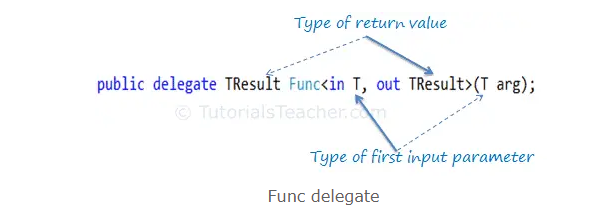

## Func delegate
C# includes built-in generic delegate types **`Func`** and **`Action`**, so that you **don't need to define custom delegates manually** in most cases (No need to declare delegate).

**`Func`** is a generic delegate included in the System namespace.


It has zero or atmost 16 input parameters and one out parameter. The last parameter is considered as an out parameter.

> The last parameter in the angle brackets **`<>`** is considered the **return type**, and the **remaining** parameters are considered **input parameter types**.





```cs
public delegate TResult Func<out TResult>();
```
```cs
public delegate TResult Func<in T,out TResult>(T arg);
```
...
```cs
public delegate TResult Func<in T1,in T2,in T3,in T4,in T5,in T6,in T7,in T8,in T9,in T10,in T11,in T12,in T13,in T14,in T15,in T16,out TResult>(T1 arg1, T2 arg2, T3 arg3, T4 arg4, T5 arg5, T6 arg6, T7 arg7, T8 arg8, T9 arg9, T10 arg10, T11 arg11, T12 arg12, T13 arg13, T14 arg14, T15 arg15, T16 arg16);
```


> **Note**: A Func delegate type can include 0 to 16 input parameters of different types. However, it must include an out parameter for the result.


Eg:
```cs
static int Sum(int x, int y)
    {
        return x + y;
    }

    static void Main(string[] args)
    {
        Func<int,int, int> add = Sum;

        int result = add(10, 10);

        Console.WriteLine(result); 
    }
```


> **Func** with an **Anonymous Method**

```cs
Func<int> getRandomNumber = delegate()
                            {
                                Random rnd = new Random();
                                return rnd.Next(1, 100);
                            };

```
> **Func** with **Lambda Expressio**n

```cs
Func<int> getRandomNumber = () => new Random().Next(1, 100);

//Or 

Func<int, int, int>  Sum  = (x, y) => x + y;
```


- **Func** is built-in delegate type.
- **Func** delegate type must return a value.
- **Func** delegate type can have zero to 16 input parameters.
- **Func** delegate does not allow ref and out parameters.
- **Func** delegate type can be used with an **anonymous method** or **lambda expression**.


### ref 
https://learn.microsoft.com/en-us/dotnet/api/system.func-2?view=net-7.0

https://www.tutorialsteacher.com/csharp/csharp-func-delegate
