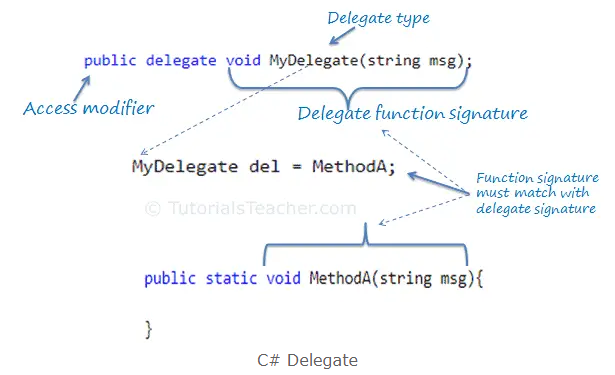

## Delegate

if we want to **pass a function as a parameter**? How does C# handles the callback functions or event handler? The answer is - **"delegate"**.

A **delegate** is a **type** that represents **references to methods with a particular parameter list and return type**. When you instantiate a delegate, you can associate its instance with any method with a compatible signature and return type. You can **invoke (or call) the method** through the **delegate instance**.

**Delegates** are also used to **pass methods as arguments to other methods**. 


Delegates have the following properties:

-   Delegates are similar to C++ function pointers, but delegates are fully object-oriented, and unlike C++ pointers to member functions, delegates encapsulate both an object instance and a method.
-   Delegates allow methods to be passed as parameters.
-   Delegates can be used to define callback methods.
-   Delegates can be chained together; for example, multiple methods can be called on a single event.
-   Methods don't have to match the delegate type exactly. For more information, see [Using Variance in Delegates](chrome-extension://pcmpcfapbekmbjjkdalcgopdkipoggdi/_generated_background_page.html../concepts/covariance-contravariance/using-variance-in-delegates).
-   Lambda expressions are a more concise way of writing inline code blocks. Lambda expressions (in certain contexts) are compiled to delegate types. For more information about lambda expressions, see [Lambda expressions](chrome-extension://pcmpcfapbekmbjjkdalcgopdkipoggdi/_generated_background_page.html../../language-reference/operators/lambda-expressions).
-   A [delegate](chrome-extension://pcmpcfapbekmbjjkdalcgopdkipoggdi/_generated_background_page.html../../language-reference/builtin-types/reference-types) is a type that safely encapsulates a method, similar to a function pointer in C and C++. Unlike C function pointers, delegates are object-oriented, type safe, and secure. The type of a delegate is defined by the name of the delegate.


### Using delegate
There are three steps involved while working with delegates:

1.  **Declare a delegate**
2.  **Set a target method**
3.  **Invoke a delegate**

A **delegate** can be declared using the delegate keyword followed by a function signature

```cs

[access modifier] delegate [return type] [delegate name]([parameters])
```


#### Declare a Delegate
```cs
public delegate void Del(string message);


```

#### Create a target method for a delegate
```CS
// Create a method for a delegate.
public static void DelegateMethod(string message)
{
    Console.WriteLine(message);
}
```

#### Instantiate the delegate & set target method

```cs
// Instantiate the delegate and Set target method
Del handler = DelegateMethod;


// Or 
Del handler = new Del(DelegateMethod);


// Or set lambda expression
Del handler = (string msg) =>  Console.WriteLine(msg);

```

#### Call or Invoke the delegate
```cs
handler.Invoke("Hello World!");

// Or
handler("Hello World!");

```



Eg:

```cs

public delegate void MyDelegate(string msg);

public delegate int PerformCalculation(int x, int y);

```

```cs
public delegate void MyDelegate(string msg); //declaring a delegate

class Program
{
    static void Main(string[] args)
    {
        MyDelegate del = ClassA.MethodA;
        del("Hello World");

        del = ClassB.MethodB;
        del("Hello World");

        del = (string msg) => Console.WriteLine("Called lambda expression: " + msg);
        del("Hello World");
    }
}

class ClassA
{
    static void MethodA(string message)
    {
        Console.WriteLine("Called ClassA.MethodA() with parameter: " + message);
    }
}

class ClassB
{
    static void MethodB(string message)
    {
        Console.WriteLine("Called ClassB.MethodB() with parameter: " + message);
    }
}
```


### Passing Delegate as a Parameter
A method can have a parameter of the delegate type
```cs
public delegate void MyDelegate(string msg); //declaring a delegate

class Program
{
    static void Main(string[] args)
    {
        MyDelegate del = ClassA.MethodA;
        InvokeDelegate(del);

        del = ClassB.MethodB;
        InvokeDelegate(del);

        del = (string msg) => Console.WriteLine("Called lambda expression: " + msg);
        InvokeDelegate(del);
    }

    static void InvokeDelegate(MyDelegate del) // MyDelegate type parameter
    {
        del("Hello World");
    }
}

class ClassA
{
    static void MethodA(string message)
    {
        Console.WriteLine("Called ClassA.MethodA() with parameter: " + message);
    }
}

class ClassB
{
    static void MethodB(string message)
    {
        Console.WriteLine("Called ClassB.MethodB() with parameter: " + message);
    }
}
```

### Multicast Delegate (Combine delegates)

The delegate can point to multiple methods. A delegate that points multiple methods is called a multicast delegate. The **"+"** or **"+="** operator adds a function to the invocation list, and the **"-"** and **"-="** operator removes it.


Eg:
```cs
public delegate void MyDelegate(string msg);
public class Program
{
	public static void Main()
	{
		MyDelegate del1 = ClassA.MethodA;
		MyDelegate del2 = ClassB.MethodB;
		
		MyDelegate del = del1 + del2;
		Console.WriteLine("After del1 + del2");
		del("Hello World");
		
		MyDelegate del3 = (string msg) => Console.WriteLine("Called lambda expression: " + msg);
		del += del3;
		Console.WriteLine("After del1 + del2 + del3");
		del("Hello World");
		
		del = del - del2;
		Console.WriteLine("After del - del2");
		del("Hello World");
		
		del -= del1;
		Console.WriteLine("After del1 - del1");
		del("Hello World");
	}
}

public class ClassA
{
	public static void MethodA(string message)
	{
		Console.WriteLine("Called ClassA.MethodA() with parameter: " + message);
	}
}

public class ClassB
{
	public static void MethodB(string message)
	{
		Console.WriteLine("Called ClassB.MethodB() with parameter: " + message);
	}
}


/*
Console output:

After del1 + del2
Called ClassA.MethodA() with parameter: Hello World
Called ClassB.MethodB() with parameter: Hello World
After del1 + del2 + del3
Called ClassA.MethodA() with parameter: Hello World
Called ClassB.MethodB() with parameter: Hello World
Called lambda expression: Hello World
After del - del2
Called ClassA.MethodA() with parameter: Hello World
Called lambda expression: Hello World
After del1 - del1
Called lambda expression: Hello World

 */

```


### ref
https://learn.microsoft.com/en-us/dotnet/csharp/programming-guide/delegates/

https://www.tutorialsteacher.com/csharp/csharp-delegates
