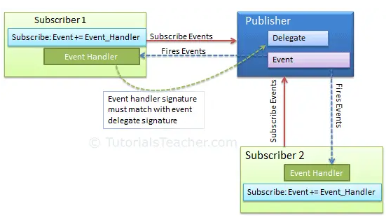

## Event

An **event** is a notification sent by an object to **signal the occurrence of an action**.

**Events** are user actions such as key press, clicks, mouse movements, etc., or some occurrence such as system generated notifications. Applications need to respond to events when they occur. 

> The **`event`** keyword is used to declare an **event** in a **publisher class**.
> Declare the event using the **`event`** keyword


- In C#, an event is an **encapsulated delegate**. It is dependent on the **delegate**. The delegate **defines the signature for the event handler** method of the **subscriber class**.
- An event is a **wrapper** around a **delegate**. It **depends on the delegate**. So use **`event`** keyword with **`delegate`** type variable to **declare an event**.
- Use built-in delegate **`EventHandler`** or **`EventHandler<TEventArgs>`** for **common event**s.
- An event is a message sent by an object to signal the occurrence of an action. The action can be caused by user interaction, such as a button click, or it can result from some other program logic, such as changing a property's value.
- The object that **raises the event** is called the **event sender**. 
- The event sender doesn't know which object or method will **receive (handle) the events** it raises.
- The event is typically a member of the event sender; for example, the **`Click`** event is a member of the **`Button`** class, and the **`PropertyChanged`** event is a member of the class that implements the **`INotifyPropertyChanged`** interface.
- Typically, to **raise an event**, you add a method that is marked as **`protected`** and **`virtual`** (in C#)
- Name this method **`OnEventName`**; for example, **`OnDataReceived`**. Name the method which raises an event prefixed with **"On"** with the event name.
- The signature of the handler method must match the delegate signature.
- The method should take one parameter that specifies an event data object, which is an object of type **`EventArgs`** or a derived type.
- You provide this method to enable derived classes to **override the logic** for **raising the event**.
- A derived class should always call the **`OnEventName`** method of the base class to ensure that registered **`delegates`** receive the event.
- Events can be declared **`static`**, **`virtual`**, **`sealed`**, and **`abstract`**.
- An Interface can include the **event** as a member.

Declare an **`event`** associated with the **EventHandler delegate** and being **raised**:
```cs
class Counter
{
    public event EventHandler ThresholdReached;

    protected virtual void OnThresholdReached(EventArgs e)
    {
        ThresholdReached?.Invoke(this, e);
    }

    // provide remaining implementation for the class
}
```

### Publisher class & Subscriber class
The **events** are **declared and raise**d in a class and associated with the **event handlers using delegates** within the same class or some other class. The class containing the event is used to **publish the event**. This is called the **"publisher class"**.

Some other class that **accepts this event** is called the **"subscriber class"**. Events use the **publisher-subscriber model**.

- A **publisher** is an object that contains the **definition of the event** and the **delegate**. The event-delegate association is also defined in this object. A **publisher class** object **invokes the event** and it is **notified to other objects**.

- A **subscriber** is an object that **accepts the event** and **provides an event handler**. The **delegate** in the publisher class **invokes the method (event handler) of the subscriber class**.


_

> The **publisher class** raises an event, and the **subscribe**r class registers for an event and provides the event-handler method.

Eg:
```cs
public class SampleEventArgs
{
    public SampleEventArgs(string text) { Text = text; }
    public string Text { get; } // readonly
}

public class Publisher
{
    // Declare the delegate (if using non-generic pattern).
    public delegate void SampleEventHandler(object sender, SampleEventArgs e);

    // Declare the event.
    public event SampleEventHandler SampleEvent;

    // Wrap the event in a protected virtual method
    // to enable derived classes to raise the event.
    protected virtual void RaiseSampleEvent()
    {
        // Raise the event in a thread-safe manner using the ?. operator.
        SampleEvent?.Invoke(this, new SampleEventArgs("Hello"));
    }
}


````


### Subscribe & Unsubscribe the event
> registers with the event using "+=" operator

> unscribe with the event using "-=" perator

Eg:
```cs

void HandleCustomEvent(object sender, CustomEventArgs a)  
{  
   // Do something useful here.  
}

```


```cs

publisher.RaiseCustomEvent += HandleCustomEvent;

```
```cs
publisher.RaiseCustomEvent += (object o, CustomEventArgs e) =>
{  
  string s = o.ToString() + " " + e.ToString();  
  Console.WriteLine(s);  
};
```


```cs
publisher.RaiseCustomEvent -= HandleCustomEvent;
```


```cs
using System;

namespace DotNetEvents
{
    // Define a class to hold custom event info
    public class CustomEventArgs : EventArgs
    {
        public CustomEventArgs(string message)
        {
            Message = message;
        }

        public string Message { get; set; }
    }

    // Class that publishes an event
    class Publisher
    {
        // Declare the event using EventHandler<T>
        public event EventHandler<CustomEventArgs> RaiseCustomEvent;

        public void DoSomething()
        {
            // Write some code that does something useful here
            // then raise the event. You can also raise an event
            // before you execute a block of code.
            OnRaiseCustomEvent(new CustomEventArgs("Event triggered"));
        }

        // Wrap event invocations inside a protected virtual method
        // to allow derived classes to override the event invocation behavior
        protected virtual void OnRaiseCustomEvent(CustomEventArgs e)
        {
            // Make a temporary copy of the event to avoid possibility of
            // a race condition if the last subscriber unsubscribes
            // immediately after the null check and before the event is raised.
            EventHandler<CustomEventArgs> raiseEvent = RaiseCustomEvent;

            // Event will be null if there are no subscribers
            if (raiseEvent != null)
            {
                // Format the string to send inside the CustomEventArgs parameter
                e.Message += $" at {DateTime.Now}";

                // Call to raise the event.
                raiseEvent(this, e);
            }
        }
    }

    //Class that subscribes to an event
    class Subscriber
    {
        private readonly string _id;

        public Subscriber(string id, Publisher pub)
        {
            _id = id;

            // Subscribe to the event
            pub.RaiseCustomEvent += HandleCustomEvent;
        }

        // Define what actions to take when the event is raised.
        void HandleCustomEvent(object sender, CustomEventArgs e)
        {
            Console.WriteLine($"{_id} received this message: {e.Message}");
        }
    }

    class Program
    {
        static void Main()
        {
            var pub = new Publisher();
            var sub1 = new Subscriber("sub1", pub);
            var sub2 = new Subscriber("sub2", pub);

            // Call the method that raises the event.
            pub.DoSomething();

            // Keep the console window open
            Console.WriteLine("Press any key to continue...");
            Console.ReadLine();
        }
    }
}
```

### Event handlers
To respond to an event, you define an event handler method in the event receiver. 
> This method **must match the signature of the delegate for the event** you're handling. 


### Declare an Event

An event can be declared in two steps:

1.  Declare a **delegate**.
2.  Declare a variable of the delegate with **`event`** keyword.

```cs
public delegate void Notify();  // delegate
                    
public class ProcessBusinessLogic
{
    public event Notify ProcessCompleted; // event

}
```


### event Action<>
```cs
public event Action<bool, int, Blah> DiagnosticsEvent;
```

### Raising an Event

```cs
public delegate void Notify();  // delegate
                    
public class ProcessBusinessLogic
{
    public event Notify ProcessCompleted; // event

    public void StartProcess()
    {
        Console.WriteLine("Process Started!");
        // some code here..
        OnProcessCompleted();
    }

    protected virtual void OnProcessCompleted() //protected virtual method
    {
        //if ProcessCompleted is not null then call delegate
        ProcessCompleted?.Invoke(); 
    }
}
```

### Consume an Event & event handler

```cs
class Program
{
    public static void Main()
    {
        // consume an event
        ProcessBusinessLogic bl = new ProcessBusinessLogic();
        bl.ProcessCompleted += bl_ProcessCompleted; // register with an event
        bl.StartProcess();
    }

    // event handler
    public static void bl_ProcessCompleted()
    {
        Console.WriteLine("Process Completed!");
    }
}
```


### Example of raising event, publisher and subscriber

```cs
using System;

namespace DotNetEvents
{
    // Define a class to hold custom event info
    public class CustomEventArgs : EventArgs
    {
        public CustomEventArgs(string message)
        {
            Message = message;
        }

        public string Message { get; set; }
    }

    // Class that publishes an event
    class Publisher
    {
        // Declare the event using EventHandler<T>
        public event EventHandler<CustomEventArgs> RaiseCustomEvent;

        public void DoSomething()
        {
            // Write some code that does something useful here
            // then raise the event. You can also raise an event
            // before you execute a block of code.
            OnRaiseCustomEvent(new CustomEventArgs("Event triggered"));
        }

        // Wrap event invocations inside a protected virtual method
        // to allow derived classes to override the event invocation behavior
        protected virtual void OnRaiseCustomEvent(CustomEventArgs e)
        {
            // Make a temporary copy of the event to avoid possibility of
            // a race condition if the last subscriber unsubscribes
            // immediately after the null check and before the event is raised.
            EventHandler<CustomEventArgs> raiseEvent = RaiseCustomEvent;

            // Event will be null if there are no subscribers
            if (raiseEvent != null)
            {
                // Format the string to send inside the CustomEventArgs parameter
                e.Message += $" at {DateTime.Now}";

                // Call to raise the event.
                raiseEvent(this, e);
            }
        }
    }

    //Class that subscribes to an event
    class Subscriber
    {
        private readonly string _id;

        public Subscriber(string id, Publisher pub)
        {
            _id = id;

            // Subscribe to the event
            pub.RaiseCustomEvent += HandleCustomEvent;
        }

        // Define what actions to take when the event is raised.
        void HandleCustomEvent(object sender, CustomEventArgs e)
        {
            Console.WriteLine($"{_id} received this message: {e.Message}");
        }
    }

    class Program
    {
        static void Main()
        {
            var pub = new Publisher();
            var sub1 = new Subscriber("sub1", pub);
            var sub2 = new Subscriber("sub2", pub);

            // Call the method that raises the event.
            pub.DoSomething();

            // Keep the console window open
            Console.WriteLine("Press any key to continue...");
            Console.ReadLine();
        }
    }
}
```

### ref 
https://www.tutorialsteacher.com/csharp/csharp-event

https://learn.microsoft.com/en-us/dotnet/standard/events/

https://learn.microsoft.com/en-us/dotnet/csharp/language-reference/keywords/event

https://medium.com/nerd-for-tech/c-delegates-actions-events-summary-please-8fab0244a40a

https://learn.microsoft.com/en-us/dotnet/csharp/programming-guide/events/
