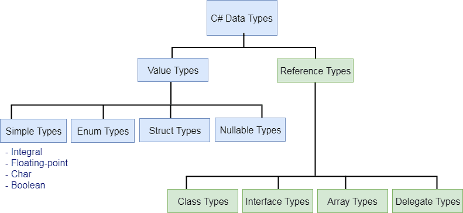

## Types


The variables in C#, are categorized into the following types: 

- **Value Types**
    
    The value types directly contain data, can be assigned a value directly.
  
    **eg:** 
    ```csharp
    byte num = 0xA;
    
    int i = 5;
    
    char c = 'Z';
    ```
    **Built-in value types**
    
    | Type | Size (in bits) | Range | Default |
    | --- | --- | --- | --- |
    | sbyte | 8 | -128 to 127 | 0 |
    | byte | 8 | 0 to 255 | 0 |
    | short | 16 | -32768 to 32767 | 0 |
    | ushort | 16 | 0 to 65535 | 0 |
    | int | 32 | -2147483648 to 2147483647 | 0 |
    | uint | 32 | 0 to 4294967295 | 0 |
    | long | 64 | -9223372036854775808 to 9223372036854775807 | 0L |
    | double | 64 | (+/-)5.0 x 10-324 to (+/-)1.7 x 10308 | 0.0D |
    | float | 32 | -3.4 x 1038 to + 3.4 x 1038 | 0.0F |
    | decimal | 128 | 128 | 0.0M |
    | ulong | 64 | 0 to 18446744073709551615 | 0 |
    | char | 16 | 0 to 65535 | '\0’ |
    | bool |  | True or False | False |
    
    
    > **struct**, **enum**, **Nullable type** are also value types
   
- **Reference Types**

    The **reference types** do not contain the actual data stored in a variable, but they contain a **reference to the variables**. 
    
    A type that is defined as a [class](https://docs.microsoft.com/en-us/dotnet/csharp/language-reference/keywords/class), [delegate](https://docs.microsoft.com/en-us/dotnet/csharp/language-reference/keywords/delegate), array, or [interface](https://docs.microsoft.com/en-us/dotnet/csharp/language-reference/keywords/interface) 

- **Pointer Types**
    
  **Store the memory address of another type**. Pointers in C# have the same capabilities as the pointers in C or C++.
  
  **unsafe code** (Pointer type is available only in unsafe code)
  
  Syntax:
  ```
  type* identifier;
  ```
  eg:
  ```csharp
    char* cptr;
    int* iptr;
   ```
  > A pointer is a variable whose value is the address of another variable

### value types vs reference type
**Value types** differ from reference types in that variables of the value types directly contain their data, whereas variables of the **reference types** store references to their data, the latter being known as **objects**. 

In other words, they refer to a memory location. Using multiple variables, the reference types can refer to a memory location. If the data in the memory location is changed by one of the variables, the other variable automatically reflects this change in value.


### Type-testing operators and cast expressions

- **`is`**: \
  The `is` operator checks if the run-time type of an expression result is compatible with a given type.
- **`as`**: \
  The `as` operator explicitly converts the result of an expression to a given reference or nullable value type.
- `typeof`: \
  The `typeof` operator obtains the `System.Type` instance for a type. The argument to the `typeof` operator must be the name of a type or a type parameter.


https://learn.microsoft.com/en-us/dotnet/csharp/language-reference/operators/type-testing-and-cast#as-operator

### **C# Type Casting**

Type casting is when you assign a value of one data type to another [type.In](http://type.in/) C#, there are two types of casting:

- **Implicit Casting** (automatically) - converting a smaller type to a larger type size `char` → `int` → `long` → `float` → `double`
- **Explicit Casting** (manually) - converting a larger type to a smaller size type. Explicit casting must be done manually by placing the type in parentheses in front of the value `double` → `float` → `long` → `int` → `char`

Implicit conversion: a built-in numeric types, an implicit conversion can be made when the value to be stored can fit into the variable without being truncated or rounded off. 
```cs
int num = 2147483647;
long bigNum = num;
```

Explicit conversion
```cs
double x = 1234.7;
int a;
// Cast double to int.
 a = (int)x;   //1234
```
#### Cast expression
A cast expression of the form **`(T)E`** performs an explicit conversion of the result of expression **`E`** to type **`T`**. If no explicit conversion exists from the **type of `E`** to **type `T`**, a compile-time error occurs. 
At run time, an explicit conversion might not succeed and a **cast expression might throw an exception**.

https://learn.microsoft.com/en-us/dotnet/csharp/language-reference/operators/type-testing-and-cast#cast-expression

https://docs.microsoft.com/en-us/dotnet/csharp/programming-guide/types/casting-and-type-conversions

#### User-defined conversions
https://learn.microsoft.com/en-us/dotnet/csharp/language-reference/language-specification/conversions#105-user-defined-conversions

### Unmanaged types
A type is an **unmanaged type** if it's any of the following types:

-   `sbyte`, `byte`, `short`, `ushort`, `int`, `uint`, `long`, `ulong`, `nint`, `nuint`, `char`, `float`, `double`, `decimal`, or `bool`
-   Any enum type
-   Any pointer type
-   Any user-defined struct type that contains fields of unmanaged types only.

